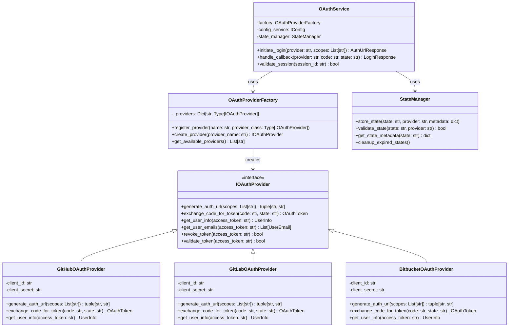
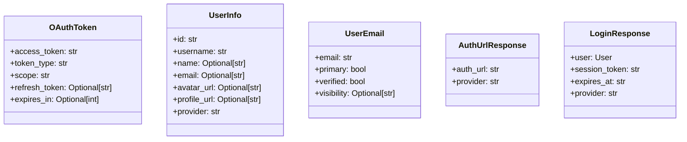

# Multi-Provider OAuth Service Architecture Design

## Executive Summary

This document outlines the design for a new multi-provider OAuth service that replaces the current GitHub-specific implementation with a flexible, extensible architecture supporting multiple OAuth providers (GitHub, GitLab, Bitbucket, Google, etc.).

## Current Implementation Analysis

### Existing Components
1. **GitHub-specific endpoints**: 
   - [`login_github.py`](../api/v0/auth/login_github.py:1): Initiates GitHub OAuth flow
   - [`callback_github.py`](../api/v0/auth/callback_github.py:1): Handles OAuth callback
   
2. **GitHub Service**: 
   - [`github_service.py`](../services/github_service.py:1): Monolithic service handling all GitHub OAuth operations
   
3. **Configuration Service**:
   - Uses Strategy pattern for hosting types
   - Already supports multiple OAuth configs via [`OAuthConfig`](../schemas/config.py:22) model

### Current Limitations
- Tightly coupled to GitHub OAuth
- No abstraction for multiple providers
- Provider-specific logic scattered across endpoints
- State management is in-memory and GitHub-specific

## Proposed Architecture

### Design Pattern: Strategy Pattern with Factory

The new architecture uses the **Strategy Pattern** for OAuth providers, similar to how the config service handles hosting types. A Factory will instantiate the appropriate provider strategy based on request parameters or configuration.

### Why Strategy Pattern?

1. **Consistency**: Aligns with existing config service architecture
2. **Extensibility**: Easy to add new providers without modifying existing code
3. **Testability**: Each provider can be tested in isolation
4. **SOLID Principles**: 
   - Single Responsibility: Each provider handles its own OAuth flow
   - Open/Closed: Open for extension (new providers), closed for modification
   - Interface Segregation: Clean interface for all providers
   - Dependency Inversion: Depend on abstractions, not concrete implementations

## Architecture Components

### Core Components



### Data Models



## Implementation Details

### 1. OAuth Provider Interface ([`oauth_interface.py`](../services/oauth/oauth_interface.py))

```python
from abc import ABC, abstractmethod
from typing import List, Tuple, Optional
from pydantic import BaseModel

class IOAuthProvider(ABC):
    """Abstract base class for OAuth providers"""
    
    @abstractmethod
    def __init__(self, client_id: str, client_secret: str):
        """Initialize provider with OAuth credentials"""
        pass
    
    @abstractmethod
    async def generate_auth_url(self, scopes: List[str], state: Optional[str] = None) -> Tuple[str, str]:
        """Generate OAuth authorization URL"""
        pass
    
    @abstractmethod
    async def exchange_code_for_token(self, code: str, state: Optional[str] = None) -> OAuthToken:
        """Exchange authorization code for access token"""
        pass
    
    @abstractmethod
    async def get_user_info(self, access_token: str) -> UserInfo:
        """Get user information from provider"""
        pass
```

### 2. Provider Factory ([`oauth_factory.py`](../services/oauth/oauth_factory.py))

```python
class OAuthProviderFactory:
    """Factory for creating OAuth provider instances"""
    
    _providers: Dict[str, Type[IOAuthProvider]] = {}
    
    @classmethod
    def register_provider(cls, name: str, provider_class: Type[IOAuthProvider]):
        """Register a new OAuth provider"""
        cls._providers[name.lower()] = provider_class
    
    @classmethod
    def create_provider(cls, provider_name: str, config_service: IConfig) -> IOAuthProvider:
        """Create provider instance using config service"""
        provider_name = provider_name.lower()
        
        if provider_name not in cls._providers:
            raise ValueError(f"Unknown OAuth provider: {provider_name}")
        
        # Get OAuth config from config service
        oauth_configs = config_service.get_oauth_configs()
        provider_config = next(
            (cfg for cfg in oauth_configs if cfg.provider == provider_name),
            None
        )
        
        if not provider_config:
            raise ValueError(f"No configuration found for provider: {provider_name}")
        
        # Create provider instance
        provider_class = cls._providers[provider_name]
        return provider_class(
            client_id=provider_config.client_id,
            client_secret=provider_config.client_secret
        )
```

### 3. OAuth Service ([`oauth_service.py`](../services/oauth/oauth_service.py))

```python
class OAuthService:
    """Main OAuth service handling all providers"""
    
    def __init__(self, config_service: IConfig):
        self.config_service = config_service
        self.factory = OAuthProviderFactory()
        self.state_manager = StateManager()
    
    async def initiate_login(self, provider: str, scopes: List[str]) -> AuthUrlResponse:
        """Initiate OAuth login for specified provider"""
        # Create provider instance
        oauth_provider = self.factory.create_provider(provider, self.config_service)
        
        # Generate auth URL
        auth_url, state = await oauth_provider.generate_auth_url(scopes)
        
        # Store state with provider info
        self.state_manager.store_state(state, provider, {"scopes": scopes})
        
        return AuthUrlResponse(auth_url=auth_url, provider=provider)
    
    async def handle_callback(self, provider: str, code: str, state: str) -> LoginResponse:
        """Handle OAuth callback for specified provider"""
        # Validate state
        if not self.state_manager.validate_state(state, provider):
            raise ValueError("Invalid or expired state")
        
        # Create provider instance
        oauth_provider = self.factory.create_provider(provider, self.config_service)
        
        # Exchange code for token
        token = await oauth_provider.exchange_code_for_token(code, state)
        
        # Get user info
        user_info = await oauth_provider.get_user_info(token.access_token)
        
        # Create session (using existing SessionService)
        # ... session creation logic ...
        
        return LoginResponse(...)
```

### 4. State Manager ([`state_manager.py`](../services/oauth/state_manager.py))

```python
class StateManager:
    """Manages OAuth state for CSRF protection"""
    
    def __init__(self, storage_backend="memory"):
        self.storage_backend = storage_backend
        self._states = {}  # In-memory storage
    
    def store_state(self, state: str, provider: str, metadata: dict):
        """Store OAuth state with provider and metadata"""
        self._states[state] = {
            "provider": provider,
            "metadata": metadata,
            "created_at": datetime.now(UTC)
        }
    
    def validate_state(self, state: str, provider: str) -> bool:
        """Validate state and provider match"""
        if state not in self._states:
            return False
        
        state_data = self._states[state]
        if state_data["provider"] != provider:
            return False
        
        # Check expiration (10 minutes)
        if datetime.now(UTC) - state_data["created_at"] > timedelta(minutes=10):
            del self._states[state]
            return False
        
        return True
```

## File Structure

```
backend/
├── services/
│   ├── oauth/
│   │   ├── __init__.py
│   │   ├── oauth_interface.py      # IOAuthProvider interface
│   │   ├── oauth_factory.py        # Provider factory
│   │   ├── oauth_service.py        # Main OAuth service
│   │   ├── state_manager.py        # State management
│   │   ├── models.py              # Pydantic models (OAuthToken, UserInfo, etc.)
│   │   └── providers/
│   │       ├── __init__.py
│   │       ├── github_provider.py
│   │       ├── gitlab_provider.py
│   │       ├── bitbucket_provider.py
│   │       └── google_provider.py
│   └── __init__.py                 # Export create_oauth_service()
├── api/
│   └── v0/
│       └── auth/
│           ├── login.py            # Generic login endpoint
│           ├── callback.py         # Generic callback endpoint
│           └── ...                 # Other auth endpoints
└── tests/
    └── services/
        └── oauth/
            ├── test_oauth_service.py
            ├── test_factory.py
            └── providers/
                └── test_github_provider.py
```

## Integration with Config Service

The OAuth service integrates seamlessly with the existing config service:

1. **Configuration Retrieval**: The factory uses `config_service.get_oauth_configs()` to retrieve provider credentials
2. **Multi-tenancy Support**: Works with all hosting strategies (individual, organization, multi-tenant)
3. **Dynamic Provider Selection**: Providers are selected based on runtime parameters, not compile-time decisions

### Example Integration

```python
# In services/__init__.py
def create_oauth_service() -> OAuthService:
    """Create OAuth service with appropriate config strategy"""
    config_service = ConfigStrategyFactory.get_strategy()
    return OAuthService(config_service)

# In API endpoint
from services import create_oauth_service

@router.get("/login/{provider}")
async def login(provider: str, request: Request):
    oauth_service = create_oauth_service()
    response = await oauth_service.initiate_login(provider, scopes=["user", "repo"])
    return response
```

## Migration Strategy

### Phase 1: Create new OAuth service structure
1. Implement [`IOAuthProvider`](../services/oauth/oauth_interface.py) interface
2. Create [`GitHubOAuthProvider`](../services/oauth/providers/github_provider.py) (refactor existing)
3. Implement factory and service classes
4. Add unit tests

### Phase 2: Update API endpoints
1. Create generic [`login.py`](../api/v0/auth/login.py) endpoint
2. Create generic [`callback.py`](../api/v0/auth/callback.py) endpoint
3. Deprecate GitHub-specific endpoints

### Phase 3: Add new providers
1. Implement additional providers (GitLab, Bitbucket)
2. Register providers with factory
3. Update configuration schemas if needed

## Benefits of This Design

1. **Extensibility**: Adding new providers requires only implementing the interface
2. **Maintainability**: Provider-specific logic is isolated
3. **Testability**: Each component can be tested independently
4. **Configuration**: Leverages existing config service patterns
5. **SOLID Compliance**: Follows all SOLID principles
6. **Type Safety**: Full Pydantic model validation

## Security Considerations

1. **State Management**: CSRF protection via state parameter
2. **Token Storage**: Secure storage in database (existing SessionService)
3. **Scope Management**: Provider-specific scope mapping
4. **Error Handling**: Consistent error responses across providers

## Future Enhancements

1. **Refresh Token Support**: Handle token refresh for providers that support it
2. **Redis State Storage**: Move state management to Redis for scalability
3. **Provider Discovery**: Auto-discover and register providers
4. **Webhook Support**: Handle provider webhooks for real-time updates
5. **OAuth 2.1 Support**: Upgrade to latest OAuth specifications