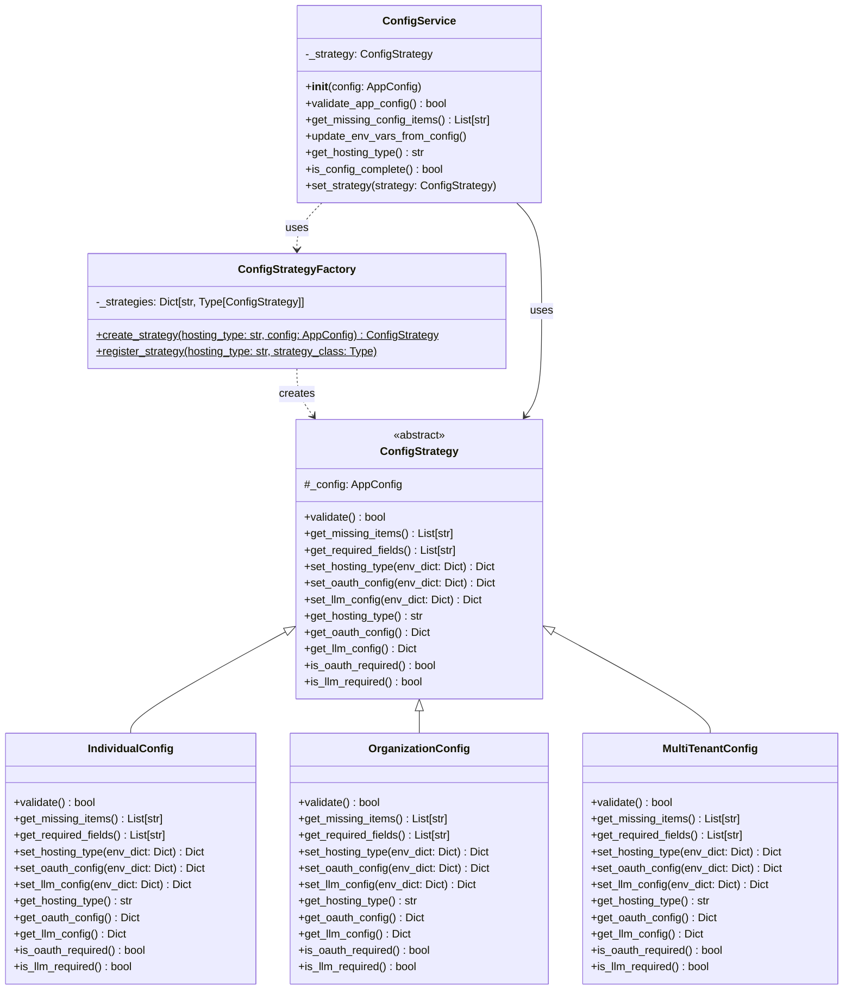

# Configuration Service Refactoring Design

## Executive Summary

This document outlines the architectural design for refactoring the configuration service to eliminate if-else conditions and improve maintainability using the Strategy Pattern combined with Factory Pattern. The new design creates a flexible, extensible system that can easily accommodate new hosting types without modifying existing code.

## Architecture Overview

### Current Problems
- Repetitive if-else chains in multiple methods (`validate_app_config`, `get_missing_config_items`, `update_env_vars_from_config`)
- Tight coupling between hosting type logic and configuration validation
- Violation of Open/Closed Principle - adding new hosting types requires modifying existing methods
- Code duplication across different methods handling the same hosting type logic

### Proposed Solution
The solution employs two key design patterns:
1. **Strategy Pattern**: Encapsulates hosting type-specific behavior in separate classes
2. **Factory Pattern**: Creates the appropriate configuration strategy based on hosting type

This approach provides:
- **Separation of Concerns**: Each hosting type has its own dedicated class
- **Open/Closed Principle**: New hosting types can be added without modifying existing code
- **Single Responsibility**: Each class has one reason to change
- **Polymorphism**: Eliminates if-else chains through method overriding

## Class Diagram



## Detailed Class Specifications

### 1. Abstract Base Class: ConfigStrategy

```python
from abc import ABC, abstractmethod
from typing import List, Dict
from schemas.config import AppConfig

class ConfigStrategy(ABC):
    """
    Abstract base class for all configuration strategies.
    Defines the interface that all hosting type configurations must implement.
    """
    
    def __init__(self, config: AppConfig):
        """
        Initialize strategy with the application configuration.
        
        Args:
            config: The application configuration object
        """
        self._config = config
    
    @abstractmethod
    def validate(self) -> bool:
        """
        Validate if the configuration is complete for this hosting type.
        
        Returns:
            bool: True if configuration is valid, False otherwise
        """
        pass
    
    @abstractmethod
    def get_missing_items(self) -> List[str]:
        """
        Get list of missing required configuration items.
        
        Returns:
            List[str]: List of missing configuration field names
        """
        pass
    
    @abstractmethod
    def get_required_fields(self) -> List[str]:
        """
        Get list of all required fields for this hosting type.
        
        Returns:
            List[str]: List of required configuration field names
        """
        pass
    
    @abstractmethod
    def update_env_vars(self, env_dict: Dict[str, str]) -> Dict[str, str]:
        """
        Update environment variables dictionary with configuration values.
        
        Args:
            env_dict: Existing environment variables dictionary
            
        Returns:
            Dict[str, str]: Updated environment variables dictionary
        """
        pass
    
    @abstractmethod
    def is_oauth_required(self) -> bool:
        """
        Check if OAuth configuration is required for this hosting type.
        
        Returns:
            bool: True if OAuth is required, False otherwise
        """
        pass
    
    @abstractmethod
    def is_llm_required(self) -> bool:
        """
        Check if LLM configuration is required for this hosting type.
        
        Returns:
            bool: True if LLM configs are required, False otherwise
        """
        pass
```

### 2. Concrete Strategy: IndividualConfig

```python
class IndividualConfig(ConfigStrategy):
    """
    Configuration strategy for individual hosting type.
    Requirements: llmConfigs only
    """
    
    def validate(self) -> bool:
        """Individual hosting requires only LLM configs."""
        return bool(self._config.llmConfigs)
    
    def get_missing_items(self) -> List[str]:
        """Check for missing LLM configs."""
        missing = []
        if not self._config.llmConfigs:
            missing.append("llmConfigs")
        return missing
    
    def get_required_fields(self) -> List[str]:
        """Individual hosting requires llmConfigs."""
        return ["llmConfigs"]
    
    def update_env_vars(self, env_dict: Dict[str, str]) -> Dict[str, str]:
        """Update environment variables for individual hosting."""
        env_dict["HOSTING_TYPE"] = "individual"
        
        # Handle LLM configs
        if self._config.llmConfigs:
            llm_configs_data = [
                {
                    "provider": config.provider,
                    "model": config.model,
                    "apiKey": config.apiKey,
                    "apiBaseUrl": config.apiBaseUrl or ""
                }
                for config in self._config.llmConfigs
            ]
            env_dict["LLM_CONFIGS"] = json.dumps(llm_configs_data)
        else:
            env_dict["LLM_CONFIGS"] = "[]"
        
        return env_dict
    
    def is_oauth_required(self) -> bool:
        """Individual hosting does not require OAuth."""
        return False
    
    def is_llm_required(self) -> bool:
        """Individual hosting requires LLM configuration."""
        return True
```

### 3. Concrete Strategy: OrganizationConfig

```python
class OrganizationConfig(ConfigStrategy):
    """
    Configuration strategy for organization hosting type.
    Requirements: githubClientId, githubClientSecret, llmConfigs
    """
    
    def validate(self) -> bool:
        """Organization hosting requires GitHub OAuth and LLM configs."""
        return bool(
            self._config.githubClientId and 
            self._config.githubClientSecret and 
            self._config.llmConfigs
        )
    
    def get_missing_items(self) -> List[str]:
        """Check for missing OAuth and LLM configs."""
        missing = []
        if not self._config.githubClientId:
            missing.append("githubClientId")
        if not self._config.githubClientSecret:
            missing.append("githubClientSecret")
        if not self._config.llmConfigs:
            missing.append("llmConfigs")
        return missing
    
    def get_required_fields(self) -> List[str]:
        """Organization hosting requires OAuth and LLM configs."""
        return ["githubClientId", "githubClientSecret", "llmConfigs"]
    
    def update_env_vars(self, env_dict: Dict[str, str]) -> Dict[str, str]:
        """Update environment variables for organization hosting."""
        env_dict["HOSTING_TYPE"] = "organization"
        
        # Handle OAuth settings
        if self._config.githubClientId:
            env_dict["GITHUB_CLIENT_ID"] = self._config.githubClientId
        if self._config.githubClientSecret:
            env_dict["GITHUB_CLIENT_SECRET"] = self._config.githubClientSecret
        
        # Handle LLM configs
        if self._config.llmConfigs:
            llm_configs_data = [
                {
                    "provider": config.provider,
                    "model": config.model,
                    "apiKey": config.apiKey,
                    "apiBaseUrl": config.apiBaseUrl or ""
                }
                for config in self._config.llmConfigs
            ]
            env_dict["LLM_CONFIGS"] = json.dumps(llm_configs_data)
        else:
            env_dict["LLM_CONFIGS"] = "[]"
        
        return env_dict
    
    def is_oauth_required(self) -> bool:
        """Organization hosting requires OAuth."""
        return True
    
    def is_llm_required(self) -> bool:
        """Organization hosting requires LLM configuration."""
        return True
```

### 4. Concrete Strategy: MultiTenantConfig

```python
class MultiTenantConfig(ConfigStrategy):
    """
    Configuration strategy for multi-tenant hosting type.
    Requirements: None (always valid)
    """
    
    def validate(self) -> bool:
        """Multi-tenant configuration is always valid."""
        return True
    
    def get_missing_items(self) -> List[str]:
        """Multi-tenant has no required configs."""
        return []
    
    def get_required_fields(self) -> List[str]:
        """Multi-tenant has no required fields."""
        return []
    
    def update_env_vars(self, env_dict: Dict[str, str]) -> Dict[str, str]:
        """Update environment variables for multi-tenant hosting."""
        env_dict["HOSTING_TYPE"] = "multi-tenant"
        # Multi-tenant doesn't manage LLM configs or OAuth in env vars
        return env_dict
    
    def is_oauth_required(self) -> bool:
        """Multi-tenant does not require OAuth configuration."""
        return False
    
    def is_llm_required(self) -> bool:
        """Multi-tenant does not require LLM configuration."""
        return False
```

### 5. Factory Class: ConfigStrategyFactory

```python
from typing import Type, Dict

class ConfigStrategyFactory:
    """
    Factory for creating configuration strategies based on hosting type.
    Implements a registry pattern for extensibility.
    """
    
    # Registry of available strategies
    _strategies: Dict[str, Type[ConfigStrategy]] = {
        "individual": IndividualConfig,
        "organization": OrganizationConfig,
        "multi-tenant": MultiTenantConfig
    }
    
    @classmethod
    def create_strategy(cls, hosting_type: str, config: AppConfig) -> ConfigStrategy:
        """
        Create appropriate configuration strategy for the hosting type.
        
        Args:
            hosting_type: The hosting type (individual, organization, multi-tenant)
            config: The application configuration
            
        Returns:
            ConfigStrategy: The appropriate strategy instance
            
        Raises:
            ValueError: If hosting type is not supported
        """
        strategy_class = cls._strategies.get(hosting_type)
        if not strategy_class:
            raise ValueError(f"Unsupported hosting type: {hosting_type}")
        
        return strategy_class(config)
    
    @classmethod
    def register_strategy(cls, hosting_type: str, strategy_class: Type[ConfigStrategy]) -> None:
        """
        Register a new strategy for a hosting type.
        Enables runtime extension of supported hosting types.
        
        Args:
            hosting_type: The hosting type identifier
            strategy_class: The strategy class to register
        """
        cls._strategies[hosting_type] = strategy_class
    
    @classmethod
    def get_supported_types(cls) -> List[str]:
        """
        Get list of all supported hosting types.
        
        Returns:
            List[str]: List of supported hosting type identifiers
        """
        return list(cls._strategies.keys())
```

### 6. Refactored ConfigService

```python
class ConfigService:
    """
    Refactored configuration service using Strategy Pattern.
    Delegates hosting-specific logic to strategy objects.
    """
    
    def __init__(self):
        """Initialize service with current configuration."""
        self._config = settings.app_config
        self._strategy = ConfigStrategyFactory.create_strategy(
            self._config.hostingType, 
            self._config
        )
    
    def set_strategy(self, strategy: ConfigStrategy) -> None:
        """
        Set a custom strategy (useful for testing).
        
        Args:
            strategy: The configuration strategy to use
        """
        self._strategy = strategy
    
    def validate_app_config(self, config: Optional[AppConfig] = None) -> bool:
        """
        Validate app configuration completeness for hosting type.
        
        Args:
            config: Optional config to validate (defaults to current config)
            
        Returns:
            bool: True if configuration is valid
        """
        if config:
            strategy = ConfigStrategyFactory.create_strategy(
                config.hostingType, 
                config
            )
            return strategy.validate()
        return self._strategy.validate()
    
    def get_missing_config_items(self) -> List[str]:
        """
        Get list of missing required configuration items.
        
        Returns:
            List[str]: List of missing configuration field names
        """
        return self._strategy.get_missing_items()
    
    def is_config_complete(self) -> bool:
        """
        Check if current configuration is complete.
        
        Returns:
            bool: True if configuration is complete
        """
        return self._strategy.validate()
    
    def update_env_vars_from_config(self, config: AppConfig) -> None:
        """
        Update .env file with configuration values.
        
        Args:
            config: The configuration to save to environment
        """
        env_file_path = Path(".env")
        
        # Read existing .env file
        existing_env = {}
        if env_file_path.exists():
            with open(env_file_path, 'r') as f:
                for line in f:
                    line = line.strip()
                    if line and not line.startswith('#') and '=' in line:
                        key, value = line.split('=', 1)
                        existing_env[key.strip()] = value.strip()
        
        # Create strategy for the config and update env vars
        strategy = ConfigStrategyFactory.create_strategy(
            config.hostingType, 
            config
        )
        updated_env = strategy.update_env_vars(existing_env)
        
        # Write updated .env file
        with open(env_file_path, 'w') as f:
            for key, value in updated_env.items():
                if key == "HOSTING_TYPE":
                    f.write(f'{key}="{value}"\n')
                else:
                    f.write(f"{key}={value}\n")
        
        # Reload settings to reflect changes
        settings.reload_settings()
        
        # Update current strategy if hosting type changed
        if config.hostingType != self._config.hostingType:
            self._config = config
            self._strategy = ConfigStrategyFactory.create_strategy(
                config.hostingType, 
                config
            )
    
    # Additional helper methods leveraging strategy
    def get_required_fields(self) -> List[str]:
        """
        Get all required fields for current hosting type.
        
        Returns:
            List[str]: List of required field names
        """
        return self._strategy.get_required_fields()
    
    def is_oauth_required(self) -> bool:
        """
        Check if OAuth is required for current hosting type.
        
        Returns:
            bool: True if OAuth is required
        """
        return self._strategy.is_oauth_required()
    
    def is_llm_required(self) -> bool:
        """
        Check if LLM configuration is required for current hosting type.
        
        Returns:
            bool: True if LLM configuration is required
        """
        return self._strategy.is_llm_required()
    
    # Existing methods that don't require strategy pattern
    def get_hosting_type(self) -> str:
        """Get current hosting type."""
        return self._config.hostingType
    
    def get_current_config(self) -> AppConfig:
        """Get current config from settings."""
        return self._config
    
    # ... (other existing methods that don't involve if-else chains)
```

## Key Benefits

### 1. Elimination of If-Else Chains
The strategy pattern completely removes if-else conditions by:
- Using polymorphism to select behavior at runtime
- Each strategy encapsulates its own validation logic
- Factory pattern handles strategy selection once

### 2. Extensibility
Adding a new hosting type requires only:
1. Create a new strategy class extending `ConfigStrategy`
2. Register it in the factory's `_strategies` dictionary
3. No modification to existing code needed

Example:
```python
class EnterpriseConfigStrategy(ConfigStrategy):
    # Implementation for new enterprise hosting type
    pass

# Register the new strategy
ConfigStrategyFactory.register_strategy("enterprise", EnterpriseConfigStrategy)
```

### 3. Testability
- Each strategy can be unit tested in isolation
- Mock strategies can be injected for testing
- Clear separation of concerns makes testing easier

### 4. Maintainability
- Single Responsibility: Each class has one reason to change
- Open/Closed: Open for extension, closed for modification
- Clear structure makes code easier to understand

### 5. Plan-Agnostic Design
- Strategies are self-contained and don't depend on external context
- Can be used anywhere in the application
- Configuration logic is centralized and reusable

## Migration Strategy

### Phase 1: Preparation
1. Create new directory structure: `backend/services/config/`
2. Implement abstract base class `ConfigStrategy`
3. Create unit tests for the new architecture

### Phase 2: Implementation
1. Implement concrete strategy classes for each hosting type
2. Implement `ConfigStrategyFactory` with registry pattern
3. Create comprehensive unit tests for each strategy

### Phase 3: Integration
1. Refactor `ConfigService` to use strategy pattern
2. Keep existing methods as facades to strategy methods
3. Ensure backward compatibility during transition

### Phase 4: Migration
1. Update all references to use new ConfigService methods
2. Run comprehensive integration tests
3. Monitor for any issues in staging environment

### Phase 5: Cleanup
1. Remove deprecated code paths
2. Update documentation
3. Perform final testing

### Rollback Plan
- Keep original implementation in a deprecated module
- Use feature flags to switch between implementations
- Maintain backward compatibility until fully validated

## Example Usage

```python
# Initialize service (automatically selects strategy)
config_service = ConfigService()

# Validate configuration (no if-else needed)
is_valid = config_service.validate_app_config()

# Get missing items (strategy handles the logic)
missing = config_service.get_missing_config_items()

# Update environment variables (strategy-specific behavior)
config_service.update_env_vars_from_config(new_config)

# Check requirements
if config_service.is_oauth_required():
    # Handle OAuth setup
    pass

# Add new hosting type at runtime
ConfigStrategyFactory.register_strategy(
    "custom", 
    CustomConfigStrategy
)
```

## Testing Strategy

### Unit Tests
Each strategy class should have comprehensive unit tests:
```python
def test_individual_strategy_validation():
    config = AppConfig(
        hostingType="individual",
        llmConfigs=[...],
        githubClientId="",
        githubClientSecret=""
    )
    strategy = IndividualConfig(config)
    assert strategy.validate() == True
    assert strategy.is_oauth_required() == False
```

### Integration Tests
Test factory and service integration:
```python
def test_factory_creates_correct_strategy():
    config = AppConfig(hostingType="organization", ...)
    strategy = ConfigStrategyFactory.create_strategy("organization", config)
    assert isinstance(strategy, OrganizationConfig)
```

### Edge Cases
- Invalid hosting types
- Null/empty configurations
- Migration between hosting types
- Concurrent configuration updates

## Conclusion

This design successfully eliminates all if-else conditions through the strategic use of design patterns. The Strategy Pattern encapsulates hosting-specific behavior, while the Factory Pattern handles strategy instantiation. The result is a clean, extensible, and maintainable architecture that adheres to SOLID principles and can easily accommodate future requirements without modifying existing code.

The refactored architecture provides:
- **Zero if-else chains** in configuration logic
- **Complete extensibility** for new hosting types
- **Clear separation of concerns** between different configurations
- **Improved testability** through isolated strategy classes
- **Better maintainability** through adherence to SOLID principles

This design serves as a blueprint for implementing a robust, scalable configuration service that can grow with the application's needs while maintaining code quality and readability.