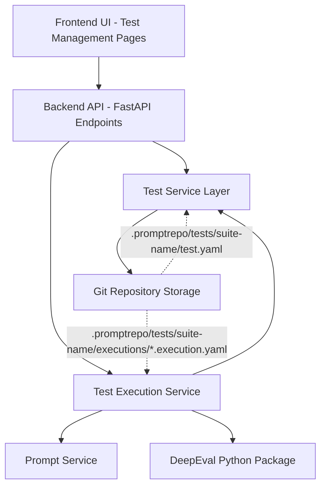
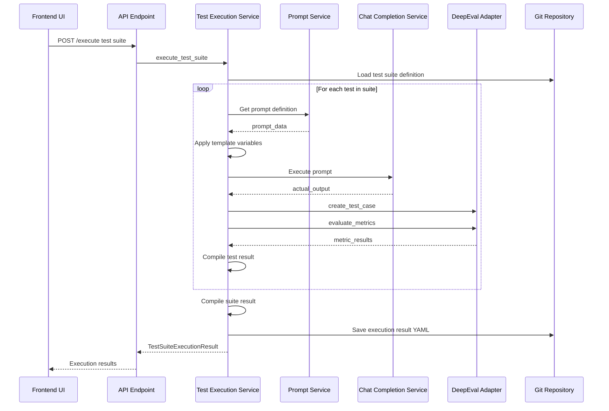

# DeepEval Prompt Testing Framework - Design Document

## Table of Contents

1. [System Architecture Overview](#1-system-architecture-overview)
2. [Data Models (Pydantic)](#2-data-models-pydantic)
3. [YAML File Structure](#3-yaml-file-structure)
4. [Backend Service Architecture](#4-backend-service-architecture)
5. [API Endpoints](#5-api-endpoints)
6. [Test Execution Workflow](#6-test-execution-workflow)
7. [Frontend UI Design](#7-frontend-ui-design)
8. [Zustand Store Design](#8-zustand-store-design)
9. [DeepEval Integration Strategy](#9-deepeval-integration-strategy)
10. [Implementation Checklist](#10-implementation-checklist)
11. [File Storage Structure](#11-file-storage-structure)

---

## 1. System Architecture Overview

The system integrates DeepEval as an orchestration layer, providing UI-driven test management for LLM prompt evaluation. The architecture follows existing patterns with file-based storage in git repositories.



### Integration Approach

- **DeepEval as Orchestration Layer**: Leverages DeepEval's pre-built metrics for LLM evaluation
- **File-Based Storage**: All test definitions and execution results stored as YAML files in git repository
- **UI-Driven Management**: Complete test lifecycle management through web interface
- **Existing Service Reuse**: Utilizes existing `ChatCompletionService` for prompt execution

---

## 2. Data Models (Pydantic)

### File Location
`backend/services/test/models.py`

### 2.1 Metric Configuration Models

```python
from enum import Enum
from typing import Dict, Any, List, Optional
from datetime import datetime
from pydantic import BaseModel, Field

class MetricType(str, Enum):
    """Predefined DeepEval metrics supported in UI"""
    ANSWER_RELEVANCY = "answer_relevancy"
    FAITHFULNESS = "faithfulness"
    CONTEXTUAL_RELEVANCY = "contextual_relevancy"
    CONTEXTUAL_PRECISION = "contextual_precision"
    CONTEXTUAL_RECALL = "contextual_recall"
    HALLUCINATION = "hallucination"
    BIAS = "bias"
    TOXICITY = "toxicity"

class MetricConfig(BaseModel):
    """Configuration for a single DeepEval metric"""
    type: MetricType = Field(description="Type of DeepEval metric")
    threshold: float = Field(default=0.7, ge=0.0, le=1.0, description="Minimum passing score")
    model: str = Field(default="gpt-4", description="LLM model for metric evaluation")
    include_reason: bool = Field(default=True, description="Include reasoning in results")
    strict_mode: bool = Field(default=False, description="Enable strict evaluation mode")
```

### 2.2 Test Definition Models

```python
class UnitTestDefinition(BaseModel):
    """Individual test case definition"""
    name: str = Field(description="Unique test name within suite")
    description: Optional[str] = Field(default="", description="Test description")
    prompt_reference: str = Field(description="Reference to prompt file path")
    template_variables: Dict[str, Any] = Field(
        default_factory=dict,
        description="Template variables for prompt execution"
    )
    expected_output: Optional[str] = Field(default=None, description="Expected output for comparison")
    retrieval_context: Optional[List[str]] = Field(
        default=None,
        description="Context for RAG evaluation metrics"
    )
    metrics: List[MetricConfig] = Field(description="DeepEval metrics to evaluate")
    enabled: bool = Field(default=True, description="Whether test is enabled")

class TestSuiteDefinition(BaseModel):
    """Test suite containing multiple unit tests"""
    name: str = Field(description="Test suite name")
    description: Optional[str] = Field(default="", description="Suite description")
    tests: List[UnitTestDefinition] = Field(
        default_factory=list,
        description="Unit tests in this suite"
    )
    tags: List[str] = Field(default_factory=list, description="Tags for organization")
    created_at: datetime = Field(default_factory=datetime.utcnow)
    updated_at: datetime = Field(default_factory=datetime.utcnow)

class TestSuiteData(BaseModel):
    """Wrapper for YAML serialization"""
    test_suite: TestSuiteDefinition
```

### 2.3 Execution Result Models

```python
class MetricResult(BaseModel):
    """Result from a single metric evaluation"""
    type: MetricType
    score: float = Field(description="Metric score (0.0 to 1.0)")
    passed: bool = Field(description="Whether metric passed threshold")
    threshold: float
    reason: Optional[str] = Field(default=None, description="Explanation from DeepEval")
    error: Optional[str] = Field(default=None, description="Error if metric failed to execute")

class UnitTestExecutionResult(BaseModel):
    """Execution result for a single unit test"""
    test_name: str
    prompt_reference: str
    template_variables: Dict[str, Any]
    actual_output: str = Field(description="Output from prompt execution")
    expected_output: Optional[str] = None
    retrieval_context: Optional[List[str]] = None
    metric_results: List[MetricResult] = Field(description="Results from all metrics")
    overall_passed: bool = Field(description="Whether all metrics passed")
    execution_time_ms: int = Field(description="Execution duration in milliseconds")
    executed_at: datetime = Field(default_factory=datetime.utcnow)
    error: Optional[str] = Field(default=None, description="Error if test failed to execute")

class TestSuiteExecutionResult(BaseModel):
    """Execution result for entire test suite"""
    suite_name: str
    test_results: List[UnitTestExecutionResult]
    total_tests: int
    passed_tests: int
    failed_tests: int
    total_execution_time_ms: int
    executed_at: datetime = Field(default_factory=datetime.utcnow)

class TestSuiteExecutionData(BaseModel):
    """Wrapper for execution YAML serialization"""
    execution: TestSuiteExecutionResult
```

### 2.4 Summary Models for API Responses

```python
class TestSuiteSummary(BaseModel):
    """Summary of test suite for listing"""
    name: str
    description: str
    test_count: int
    tags: List[str]
    file_path: str
    last_execution: Optional[datetime] = None
    last_execution_passed: Optional[bool] = None
```

---

## 3. YAML File Structure

### 3.1 Test Suite Definition

**Location**: `.promptrepo/tests/{suite-name}/suite.yaml`

```yaml
test_suite:
  name: "authentication-prompts-suite"
  description: "Test suite for authentication-related prompts"
  tags:
    - "authentication"
    - "security"
  tests:
    - name: "test-login-prompt-relevancy"
      description: "Verify login prompt provides relevant answers"
      prompt_reference: "file:///.promptrepo/prompts/auth/login-assistant.yaml"
      template_variables:
        user_question: "How do I reset my password?"
        context: "Production environment"
      expected_output: "You can reset your password by clicking the 'Forgot Password' link on the login page."
      metrics:
        - type: "answer_relevancy"
          threshold: 0.8
          model: "gpt-4"
          include_reason: true
          strict_mode: false
      enabled: true
    
    - name: "test-login-prompt-faithfulness"
      description: "Verify login prompt is faithful to context"
      prompt_reference: "file:///.promptrepo/prompts/auth/login-assistant.yaml"
      template_variables:
        user_question: "What authentication methods are supported?"
      retrieval_context:
        - "We support email/password, OAuth (Google, GitHub), and SSO authentication."
      metrics:
        - type: "faithfulness"
          threshold: 0.7
          model: "gpt-4"
          include_reason: true
        - type: "hallucination"
          threshold: 0.5
          model: "gpt-4"
          include_reason: true
      enabled: true
  created_at: "2025-01-27T04:00:00Z"
  updated_at: "2025-01-27T04:00:00Z"
```

### 3.2 Execution Results

**Location**: `.promptrepo/tests/{suite-name}/executions/{suite-name}-{timestamp}.execution.yaml`

```yaml
execution:
  suite_name: "authentication-prompts-suite"
  total_tests: 2
  passed_tests: 1
  failed_tests: 1
  total_execution_time_ms: 4532
  executed_at: "2025-01-27T04:15:30Z"
  test_results:
    - test_name: "test-login-prompt-relevancy"
      prompt_reference: "file:///.promptrepo/prompts/auth/login-assistant.yaml"
      template_variables:
        user_question: "How do I reset my password?"
        context: "Production environment"
      actual_output: "You can reset your password by visiting the account settings page and clicking 'Reset Password'."
      expected_output: "You can reset your password by clicking the 'Forgot Password' link on the login page."
      metric_results:
        - type: "answer_relevancy"
          score: 0.85
          passed: true
          threshold: 0.8
          reason: "The actual output is highly relevant to the input question about password reset."
      overall_passed: true
      execution_time_ms: 2156
      executed_at: "2025-01-27T04:15:28Z"
    
    - test_name: "test-login-prompt-faithfulness"
      prompt_reference: "file:///.promptrepo/prompts/auth/login-assistant.yaml"
      template_variables:
        user_question: "What authentication methods are supported?"
      actual_output: "We support email/password, OAuth with Google and GitHub, SSO, and biometric authentication."
      retrieval_context:
        - "We support email/password, OAuth (Google, GitHub), and SSO authentication."
      metric_results:
        - type: "faithfulness"
          score: 0.65
          passed: false
          threshold: 0.7
          reason: "The output mentions biometric authentication which is not present in the retrieval context."
        - type: "hallucination"
          score: 0.3
          passed: true
          threshold: 0.5
          reason: "Low hallucination score - biometric authentication claim not supported by context."
      overall_passed: false
      execution_time_ms: 2376
      executed_at: "2025-01-27T04:15:30Z"
```

---

## 4. Backend Service Architecture

### 4.1 Service Layer Structure

```
backend/services/test/
├── __init__.py
├── models.py                    # Pydantic models (defined above)
├── test_interface.py            # Abstract interface
├── test_service.py              # Test CRUD operations
├── test_execution_service.py   # Test execution orchestration
└── deepeval_adapter.py          # DeepEval integration adapter
```

### 4.2 Test Service

**File**: `backend/services/test/test_service.py`

**Responsibilities**:
- Load/save test suite definitions from/to YAML files
- Discover test suites in repository
- CRUD operations for test suites and unit tests
- Validate test definitions

**Key Methods**:

```python
class TestService:
    def __init__(
        self, 
        local_repo_service: LocalRepoService, 
        file_operations_service: FileOperationsService
    ):
        """Constructor injection pattern"""
        self.local_repo_service = local_repo_service
        self.file_operations_service = file_operations_service
        
    async def list_test_suites(
        self, 
        user_id: str, 
        repo_name: str
    ) -> List[TestSuiteSummary]:
        """List all test suites in repository"""
        pass
    
    async def get_test_suite(
        self, 
        user_id: str, 
        repo_name: str, 
        suite_name: str
    ) -> TestSuiteData:
        """Get specific test suite definition"""
        pass
    
    async def save_test_suite(
        self, 
        user_id: str, 
        repo_name: str, 
        suite_data: TestSuiteData
    ) -> TestSuiteData:
        """Create or update test suite"""
        pass
    
    async def delete_test_suite(
        self, 
        user_id: str, 
        repo_name: str, 
        suite_name: str
    ) -> bool:
        """Delete test suite"""
        pass
    
    async def get_latest_execution(
        self, 
        user_id: str, 
        repo_name: str, 
        suite_name: str
    ) -> Optional[TestSuiteExecutionResult]:
        """Get latest execution result"""
        pass
    
    async def list_executions(
        self, 
        user_id: str, 
        repo_name: str, 
        suite_name: str, 
        limit: int = 10
    ) -> List[TestSuiteExecutionResult]:
        """List execution history"""
        pass
```

### 4.3 Test Execution Service

**File**: `backend/services/test/test_execution_service.py`

**Responsibilities**:
- Orchestrate test execution workflow
- Execute prompts with template variables
- Coordinate with DeepEval adapter for metric evaluation
- Save execution results to YAML files

**Key Methods**:

```python
class TestExecutionService:
    def __init__(
        self,
        test_service: TestService,
        prompt_service: PromptService,
        deepeval_adapter: DeepEvalAdapter,
        chat_completion_service: ChatCompletionService
    ):
        """Constructor injection"""
        self.test_service = test_service
        self.prompt_service = prompt_service
        self.deepeval_adapter = deepeval_adapter
        self.chat_completion_service = chat_completion_service
        
    async def execute_test_suite(
        self,
        user_id: str,
        repo_name: str,
        suite_name: str,
        test_names: Optional[List[str]] = None  # None = run all tests
    ) -> TestSuiteExecutionResult:
        """Execute test suite or specific tests"""
        pass
    
    async def execute_single_test(
        self,
        user_id: str,
        repo_name: str,
        suite_name: str,
        test_name: str
    ) -> UnitTestExecutionResult:
        """Execute single test"""
        pass
```

### 4.4 DeepEval Adapter

**File**: `backend/services/test/deepeval_adapter.py`

**Responsibilities**:
- Wrap DeepEval library interactions
- Convert our metric configs to DeepEval metric instances
- Convert our test case data to DeepEval LLMTestCase format
- Handle DeepEval exceptions and errors

**Key Methods**:

```python
class DeepEvalAdapter:
    def create_metric(self, config: MetricConfig):
        """Create DeepEval metric instance from config"""
        pass
        
    def create_test_case(
        self,
        input_text: str,
        actual_output: str,
        expected_output: Optional[str] = None,
        retrieval_context: Optional[List[str]] = None
    ):
        """Create DeepEval LLMTestCase"""
        pass
        
    async def evaluate_metrics(
        self,
        test_case,
        metrics: List
    ) -> List[MetricResult]:
        """Run DeepEval metrics and return results"""
        pass
```

---

## 5. API Endpoints

**Base Path**: `/api/v0/tests`

All endpoints follow the StandardResponse pattern with proper error handling.

### 5.1 Test Suite Management

**File**: `backend/api/v0/tests/suites.py`

#### List Test Suites
```
GET /api/v0/tests/suites
Query Params: repo_name (required)
Response: StandardResponse[List[TestSuiteSummary]]
Summary: List all test suites in repository
```

#### Get Test Suite
```
GET /api/v0/tests/suites/{suite_name}
Query Params: repo_name (required)
Response: StandardResponse[TestSuiteData]
Summary: Get specific test suite definition
```

#### Create/Update Test Suite
```
POST /api/v0/tests/suites
Query Params: repo_name (required)
Body: TestSuiteData
Response: StandardResponse[TestSuiteData]
Summary: Create or update test suite
Status: 200 OK (update) or 201 Created (new)
```

#### Delete Test Suite
```
DELETE /api/v0/tests/suites/{suite_name}
Query Params: repo_name (required)
Response: StandardResponse[None]
Summary: Delete test suite
Status: 204 No Content
```

### 5.2 Test Execution

**File**: `backend/api/v0/tests/execution.py`

#### Execute Test Suite
```
POST /api/v0/tests/suites/{suite_name}/execute
Query Params: 
  - repo_name (required)
  - test_names (optional, comma-separated)
Response: StandardResponse[TestSuiteExecutionResult]
Summary: Execute test suite or specific tests within suite
Status: 200 OK
```

#### Execute Single Test
```
POST /api/v0/tests/suites/{suite_name}/tests/{test_name}/execute
Query Params: repo_name (required)
Response: StandardResponse[UnitTestExecutionResult]
Summary: Execute single test
Status: 200 OK
```

#### Get Execution History
```
GET /api/v0/tests/suites/{suite_name}/executions
Query Params: 
  - repo_name (required)
  - limit (optional, default=10)
Response: StandardResponse[List[TestSuiteExecutionResult]]
Summary: Get execution history for test suite
```

#### Get Latest Execution
```
GET /api/v0/tests/suites/{suite_name}/executions/latest
Query Params: repo_name (required)
Response: StandardResponse[TestSuiteExecutionResult]
Summary: Get latest execution result
```

---

## 6. Test Execution Workflow

### 6.1 Sequence Diagram



### 6.2 Detailed Execution Steps

1. **Load Test Suite**: Read test suite definition from `.promptrepo/tests/{suite-name}/suite.yaml`

2. **For Each Test**:
   - Load referenced prompt definition
   - Apply template variables to prompt
   - Execute prompt using existing `ChatCompletionService`
   - Get `actual_output` from LLM
   - Create DeepEval `LLMTestCase` with inputs, actual_output, expected_output, retrieval_context
   - Create DeepEval metric instances based on `MetricConfig`
   - Execute metrics using DeepEval
   - Collect metric scores, pass/fail status, and reasons
   - Compile `UnitTestExecutionResult`

3. **Compile Suite Results**: Aggregate all test results into `TestSuiteExecutionResult`

4. **Save Execution**: Write execution results to `.promptrepo/tests/{suite-name}/executions/{suite-name}-{timestamp}.execution.yaml`

5. **Return Results**: Return execution results to frontend

---

## 7. Frontend UI Design

### 7.1 Page Structure

```
frontend/app/(tests)/
├── tests/
│   ├── page.tsx                    # Test suites list page
│   ├── [suite_name]/
│   │   ├── page.tsx               # Test suite detail/editor page
│   │   └── executions/
│   │       ├── page.tsx           # Execution history page
│   │       └── [execution_id]/
│   │           └── page.tsx       # Execution detail page
```

### 7.2 Component Hierarchy

```
frontend/components/tests/
├── TestSuiteList.tsx              # List of test suites
├── TestSuiteCard.tsx              # Individual suite card in list
├── TestSuiteEditor.tsx            # Edit test suite (name, description, tags)
├── UnitTestList.tsx               # List of tests within suite
├── UnitTestEditor.tsx             # Edit individual test
├── MetricSelector.tsx             # Select/configure DeepEval metrics
├── MetricConfigForm.tsx           # Configure metric parameters
├── TemplateVariableEditor.tsx     # Edit template variables
├── ExecutionResultsPanel.tsx      # Display execution results
├── MetricResultCard.tsx           # Display individual metric result
└── ExecutionHistory.tsx           # List of past executions
```

### 7.3 Key UI Features

#### Test Suite List Page (`/tests`)

- Card-based layout showing test suites
- Each card displays:
  - Suite name and description
  - Test count
  - Tags
  - Last execution status (passed/failed)
  - Last execution date
- Actions: Create new suite, delete suite, view suite

#### Test Suite Detail/Editor Page (`/tests/{suite_name}`)

- **Top section**: Suite metadata (name, description, tags)
- **Main section**: List of unit tests
  - Each test shows: name, prompt reference, metrics count, enabled status
  - Actions per test: Edit, Delete, Run single test, Enable/Disable
- **Bottom action bar**:
  - "Add Test" button
  - "Run All Tests" button
  - "Save Suite" button (if changes made)

#### Unit Test Editor (Modal/Drawer)

- Test name and description fields
- Prompt reference selector (browse prompts in repo)
- Template variables editor (key-value pairs)
- Expected output field (optional textarea)
- Retrieval context editor (optional list of strings)
- **Metrics configuration section**:
  - Metric type selector (dropdown with predefined metrics)
  - For each selected metric:
    - Threshold slider (0.0 - 1.0)
    - Model selector
    - Include reason toggle
    - Strict mode toggle
  - "Add Metric" button
- Enabled toggle
- Save/Cancel buttons

#### Execution Results Panel

- **Summary section**:
  - Total tests, passed, failed
  - Overall execution time
  - Timestamp
- **Results list** (expandable items):
  - Each test shows:
    - Test name with pass/fail indicator
    - Execution time
    - Expandable to show:
      - Template variables used
      - Actual output from LLM
      - Expected output (if defined)
      - **Metric results**:
        - Metric type and score (progress bar)
        - Pass/fail status
        - Threshold
        - Reason (expandable text)

---

## 8. Zustand Store Design

**File**: `frontend/stores/testStore.ts`

### 8.1 TypeScript Interfaces

```typescript
import { create } from 'zustand';

interface MetricConfig {
  type: string;
  threshold: number;
  model: string;
  include_reason: boolean;
  strict_mode: boolean;
}

interface UnitTestDefinition {
  name: string;
  description: string;
  prompt_reference: string;
  template_variables: Record<string, any>;
  expected_output?: string;
  retrieval_context?: string[];
  metrics: MetricConfig[];
  enabled: boolean;
}

interface TestSuiteDefinition {
  name: string;
  description: string;
  tests: UnitTestDefinition[];
  tags: string[];
  created_at: string;
  updated_at: string;
}

interface MetricResult {
  type: string;
  score: number;
  passed: boolean;
  threshold: number;
  reason?: string;
  error?: string;
}

interface UnitTestExecutionResult {
  test_name: string;
  prompt_reference: string;
  template_variables: Record<string, any>;
  actual_output: string;
  expected_output?: string;
  retrieval_context?: string[];
  metric_results: MetricResult[];
  overall_passed: boolean;
  execution_time_ms: number;
  executed_at: string;
  error?: string;
}

interface TestSuiteExecutionResult {
  suite_name: string;
  test_results: UnitTestExecutionResult[];
  total_tests: number;
  passed_tests: number;
  failed_tests: number;
  total_execution_time_ms: number;
  executed_at: string;
}
```

### 8.2 Store Definition

```typescript
interface TestStore {
  // State
  testSuites: TestSuiteDefinition[];
  currentSuite: TestSuiteDefinition | null;
  currentExecution: TestSuiteExecutionResult | null;
  executionHistory: TestSuiteExecutionResult[];
  isLoading: boolean;
  error: string | null;
  
  // Actions
  fetchTestSuites: (repoName: string) => Promise<void>;
  fetchTestSuite: (repoName: string, suiteName: string) => Promise<void>;
  saveTestSuite: (repoName: string, suite: TestSuiteDefinition) => Promise<void>;
  deleteTestSuite: (repoName: string, suiteName: string) => Promise<void>;
  
  executeTestSuite: (repoName: string, suiteName: string, testNames?: string[]) => Promise<void>;
  executeSingleTest: (repoName: string, suiteName: string, testName: string) => Promise<void>;
  
  fetchExecutionHistory: (repoName: string, suiteName: string, limit?: number) => Promise<void>;
  fetchLatestExecution: (repoName: string, suiteName: string) => Promise<void>;
  
  // Local mutations
  updateCurrentSuite: (suite: TestSuiteDefinition) => void;
  addTest: (test: UnitTestDefinition) => void;
  updateTest: (testName: string, test: UnitTestDefinition) => void;
  deleteTest: (testName: string) => void;
  clearCurrentSuite: () => void;
}

export const useTestStore = create<TestStore>((set, get) => ({
  // Initial state
  testSuites: [],
  currentSuite: null,
  currentExecution: null,
  executionHistory: [],
  isLoading: false,
  error: null,
  
  // Implementation of actions using API calls
  fetchTestSuites: async (repoName) => {
    set({ isLoading: true, error: null });
    try {
      const response = await fetch(`/api/v0/tests/suites?repo_name=${repoName}`);
      const data = await response.json();
      set({ testSuites: data.data, isLoading: false });
    } catch (error) {
      set({ error: error.message, isLoading: false });
    }
  },
  
  // ... other actions implementation
}));
```

---

## 9. DeepEval Integration Strategy

### 9.1 Supported Metrics

**Phase 1 Metrics**:

| Metric | Description | Required Fields |
|--------|-------------|----------------|
| `answer_relevancy` | Measures how relevant the answer is to the input | input, actual_output |
| `faithfulness` | Measures factual accuracy relative to retrieval context | actual_output, retrieval_context |
| `contextual_relevancy` | Measures relevance of retrieval context to input | input, retrieval_context |
| `contextual_precision` | Measures precision of retrieval context ordering | input, actual_output, expected_output, retrieval_context |
| `contextual_recall` | Measures recall of retrieval context | input, expected_output, retrieval_context |
| `hallucination` | Detects hallucinated information | actual_output, context |
| `bias` | Detects biased content | actual_output |
| `toxicity` | Detects toxic content | actual_output |

### 9.2 Metric Configuration Mapping

**File**: `backend/services/test/deepeval_adapter.py`

```python
from deepeval.metrics import (
    AnswerRelevancyMetric,
    FaithfulnessMetric,
    ContextualRelevancyMetric,
    ContextualPrecisionMetric,
    ContextualRecallMetric,
    HallucinationMetric,
    BiasMetric,
    ToxicityMetric
)

METRIC_MAPPING = {
    MetricType.ANSWER_RELEVANCY: AnswerRelevancyMetric,
    MetricType.FAITHFULNESS: FaithfulnessMetric,
    MetricType.CONTEXTUAL_RELEVANCY: ContextualRelevancyMetric,
    MetricType.CONTEXTUAL_PRECISION: ContextualPrecisionMetric,
    MetricType.CONTEXTUAL_RECALL: ContextualRecallMetric,
    MetricType.HALLUCINATION: HallucinationMetric,
    MetricType.BIAS: BiasMetric,
    MetricType.TOXICITY: ToxicityMetric,
}

def create_metric(config: MetricConfig):
    """Create DeepEval metric instance from configuration"""
    metric_class = METRIC_MAPPING[config.type]
    return metric_class(
        threshold=config.threshold,
        model=config.model,
        include_reason=config.include_reason,
        strict_mode=config.strict_mode
    )
```

### 9.3 Dependencies

**Update**: `backend/pyproject.toml`

```toml
dependencies = [
    # ... existing dependencies ...
    "deepeval>=1.0.0",
]
```

**Install**: 
```bash
cd backend && uv sync
```

---

## 10. Implementation Checklist

### 10.1 Backend Tasks

#### Models & Schema
- [ ] Create `backend/services/test/models.py` with all Pydantic models
- [ ] Add `MetricType` enum to `backend/schemas/`

#### Services
- [ ] Create `backend/services/test/test_interface.py`
- [ ] Create `backend/services/test/test_service.py` (CRUD operations)
- [ ] Create `backend/services/test/test_execution_service.py`
- [ ] Create `backend/services/test/deepeval_adapter.py`
- [ ] Add unit tests for all services

#### API Endpoints
- [ ] Create `backend/api/v0/tests/__init__.py`
- [ ] Create `backend/api/v0/tests/suites.py` (CRUD endpoints)
- [ ] Create `backend/api/v0/tests/execution.py` (execution endpoints)
- [ ] Update `backend/api/v0/__init__.py` to include tests router
- [ ] Add dependency injection in `backend/api/deps.py`

#### Integration
- [ ] Add deepeval to `pyproject.toml` dependencies
- [ ] Run `uv sync` to install dependencies
- [ ] Test DeepEval integration locally

### 10.2 Frontend Tasks

#### Types
- [ ] Create `frontend/types/test.ts` with TypeScript interfaces
- [ ] Mirror backend Pydantic models

#### Store
- [ ] Create `frontend/stores/testStore.ts` with Zustand store
- [ ] Implement API integration functions

#### Services
- [ ] Create `frontend/services/testService.ts` for API calls

#### Components
- [ ] Create `frontend/components/tests/TestSuiteList.tsx`
- [ ] Create `frontend/components/tests/TestSuiteCard.tsx`
- [ ] Create `frontend/components/tests/TestSuiteEditor.tsx`
- [ ] Create `frontend/components/tests/UnitTestList.tsx`
- [ ] Create `frontend/components/tests/UnitTestEditor.tsx`
- [ ] Create `frontend/components/tests/MetricSelector.tsx`
- [ ] Create `frontend/components/tests/MetricConfigForm.tsx`
- [ ] Create `frontend/components/tests/TemplateVariableEditor.tsx`
- [ ] Create `frontend/components/tests/ExecutionResultsPanel.tsx`
- [ ] Create `frontend/components/tests/MetricResultCard.tsx`
- [ ] Create `frontend/components/tests/ExecutionHistory.tsx`

#### Pages
- [ ] Create `frontend/app/(tests)/tests/page.tsx` (list page)
- [ ] Create `frontend/app/(tests)/tests/[suite_name]/page.tsx` (detail page)
- [ ] Create `frontend/app/(tests)/tests/[suite_name]/executions/page.tsx`
- [ ] Create `frontend/app/(tests)/tests/[suite_name]/executions/[execution_id]/page.tsx`

#### Navigation
- [ ] Add "Tests" navigation item to main menu

### 10.3 Testing & Documentation

- [ ] Add backend unit tests (pytest)
- [ ] Test end-to-end workflow manually
- [ ] Update project README with testing features
- [ ] Create user documentation for test creation and execution

---

## 11. File Storage Structure

```
.promptrepo/
├── prompts/
│   └── auth/
│       └── login-assistant.yaml
├── mock_tools/
│   └── web-search.yaml
└── tests/
    ├── authentication-prompts-suite/
    │   ├── suite.yaml                           # Test suite definition
    │   └── executions/
    │       ├── authentication-prompts-suite-2025-01-27T04-15-30.execution.yaml
    │       └── authentication-prompts-suite-2025-01-27T03-10-15.execution.yaml
    └── payment-prompts-suite/
        ├── suite.yaml
        └── executions/
            └── payment-prompts-suite-2025-01-26T10-30-00.execution.yaml
```

### File Naming Conventions

- **Suite Definition**: `suite.yaml` (one per suite directory)
- **Execution Results**: `{suite-name}-{ISO-8601-timestamp}.execution.yaml`
- **Suite Directory**: `{suite-name}/` (kebab-case, no spaces)

---

## Summary

This design provides a comprehensive framework for integrating DeepEval into the promptrepo project. The solution:

✅ **Follows existing patterns**: Mirrors prompts and tools structure with file-based storage in git

✅ **Maintains separation of concerns**: Service layer handles business logic, API endpoints are lightweight

✅ **Uses dependency injection**: Centralized in `api/deps.py` following SOLID principles

✅ **Stores everything in git**: Both test definitions and execution results as YAML files

✅ **Provides predefined metrics**: Users select from common DeepEval metrics in UI

✅ **Supports manual execution**: On-demand test running from UI

✅ **Leverages existing infrastructure**: Reuses `ChatCompletionService` for prompt execution

✅ **Provides clear UI/UX**: Similar patterns to existing mock tool creation pages

The implementation is ready to proceed with development!