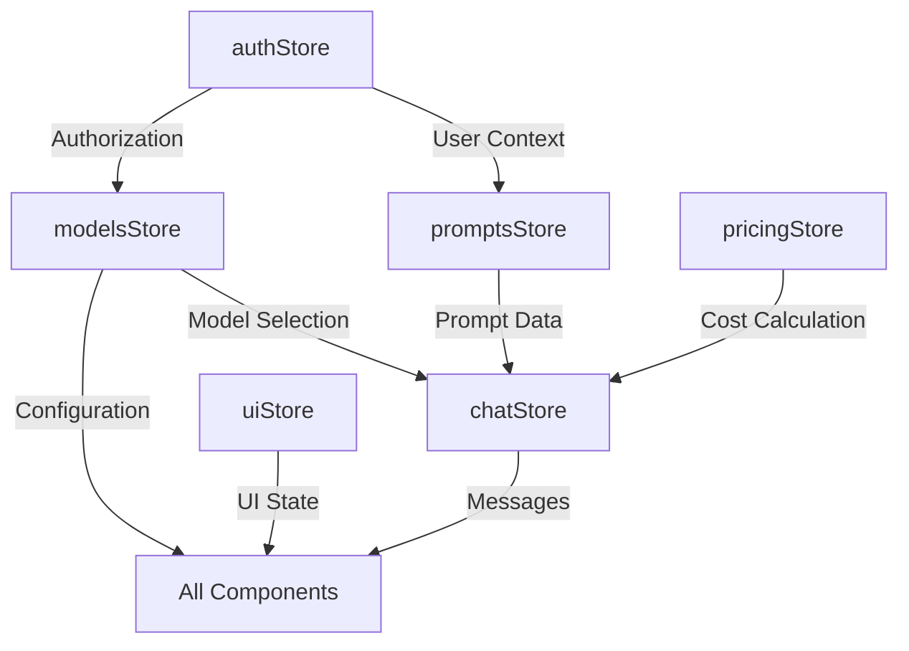

# Zustand State Management Architecture

## Executive Summary

This document outlines the comprehensive architecture for migrating the current state management system to Zustand. The migration will consolidate fragmented state management patterns (React hooks, localStorage stores, component state) into a unified, type-safe Zustand architecture.

## Current State Analysis

### Existing Patterns
1. **Custom React Hooks**: Complex state logic scattered across components
2. **localStorage Stores**: Direct storage manipulation without reactive updates
3. **Component State**: Isolated state management causing prop drilling
4. **Manual Persistence**: Inconsistent storage patterns across different stores

### Key Issues
- No centralized state management
- Inconsistent persistence strategies
- Lack of reactive updates across components
- Type safety issues with storage operations
- Complex state synchronization logic

## Zustand Store Architecture

### Core Principles
- **Single Source of Truth**: Each domain has one authoritative store
- **Type Safety**: Full TypeScript support with strict typing
- **Persistence Strategy**: Selective persistence with localStorage/sessionStorage
- **Performance**: Optimized with selective subscriptions
- **Developer Experience**: Clear, predictable API with minimal boilerplate

## Store Structure

### 1. Authentication Store (`authStore`)

```typescript
interface AuthStore {
  // State
  user: User | null
  sessionToken: string | null
  refreshToken: string | null
  isAuthenticated: boolean
  isLoading: boolean
  expiresAt: string | null
  
  // Actions
  login: (redirectUrl?: string) => Promise<void>
  logout: () => Promise<void>
  handleOAuthCallback: (code: string, state: string) => Promise<void>
  checkAuth: () => Promise<void>
  refreshSession: () => Promise<void>
  setUser: (user: User) => void
  setSession: (token: string, expiresAt: string) => void
  clearAuth: () => void
  
  // Computed
  isSessionValid: () => boolean
  shouldRefreshSession: () => boolean
}
```

**Persistence**: 
- Session token and refresh token in localStorage
- User data in sessionStorage (for security)
- Automatic session validation on hydration

### 2. Prompts Store (`promptsStore`)

```typescript
interface PromptsStore {
  // State
  prompts: Prompt[]
  selectedPrompt: Prompt | null
  isLoading: boolean
  error: string | null
  filters: PromptFilters
  
  // Actions
  loadPrompts: () => Promise<void>
  addPrompt: (prompt: Omit<Prompt, 'id' | 'created_at' | 'updated_at'>) => Promise<void>
  updatePrompt: (id: string, updates: Partial<Prompt>) => Promise<void>
  deletePrompt: (id: string) => Promise<void>
  selectPrompt: (id: string | null) => void
  searchPrompts: (query: string) => void
  setFilter: (filter: Partial<PromptFilters>) => void
  clearFilters: () => void
  
  // Computed
  filteredPrompts: () => Prompt[]
  getPromptById: (id: string) => Prompt | undefined
}
```

**Persistence**: 
- Prompts data cached in localStorage
- Selected prompt ID in sessionStorage
- Filters in sessionStorage

### 3. Models Store (`modelsStore`)

```typescript
interface ModelsStore {
  // State
  availableProviders: ProviderInfo[]
  configuredModels: LLMProvider[]
  selectedModel: ModelSelection | null
  isLoading: boolean
  error: string | null
  
  // Actions
  loadAvailableProviders: () => Promise<void>
  loadConfiguredModels: () => Promise<void>
  addModelConfig: (config: LLMConfig) => Promise<void>
  removeModelConfig: (id: string) => Promise<void>
  updateModelConfig: (id: string, updates: Partial<LLMConfig>) => Promise<void>
  selectModel: (provider: string, model: string) => void
  clearSelection: () => void
  
  // Computed
  getProviderById: (id: string) => ProviderInfo | undefined
  getConfiguredModel: (provider: string, model: string) => LLMProvider | undefined
  hasProvider: (providerId: string) => boolean
}
```

**Persistence**: 
- Configured models in localStorage
- Selected model in sessionStorage
- Available providers not persisted (fetched on demand)

### 4. Pricing Store (`pricingStore`)

```typescript
interface PricingStore {
  // State
  pricingData: PricingData | null
  lastFetchTimestamp: number | null
  isLoading: boolean
  error: string | null
  
  // Actions
  loadPricingData: (forceRefresh?: boolean) => Promise<void>
  calculateCost: (usage: TokenUsage, modelName: string) => CostCalculation | null
  clearCache: () => void
  
  // Computed
  getModelPricing: (modelName: string) => ModelPricing | null
  isCacheValid: () => boolean
  getCacheAge: () => number | null
}
```

**Persistence**: 
- Pricing data with timestamp in localStorage
- 24-hour cache expiration
- Automatic refresh on expiration

### 5. UI Store (`uiStore`)

```typescript
interface UIStore {
  // State
  modals: {
    isConfigModalOpen: boolean
    isPromptEditorOpen: boolean
    isDeleteConfirmOpen: boolean
    activeModalData: any
  }
  notifications: Notification[]
  theme: 'light' | 'dark' | 'system'
  sidebarCollapsed: boolean
  
  // Actions
  openModal: (modal: ModalType, data?: any) => void
  closeModal: (modal: ModalType) => void
  closeAllModals: () => void
  addNotification: (notification: Omit<Notification, 'id'>) => void
  removeNotification: (id: string) => void
  setTheme: (theme: 'light' | 'dark' | 'system') => void
  toggleSidebar: () => void
  
  // Computed
  hasOpenModals: () => boolean
  getActiveNotifications: () => Notification[]
}
```

**Persistence**: 
- Theme preference in localStorage
- Sidebar state in localStorage
- Modals and notifications not persisted

### 6. Chat Store (`chatStore`)

```typescript
interface ChatStore {
  // State
  conversations: Map<string, Conversation>
  activeConversationId: string | null
  messages: ChatMessage[]
  isStreaming: boolean
  streamBuffer: string
  parameters: ChatParameters
  
  // Actions
  createConversation: (promptId: string) => string
  loadConversation: (id: string) => void
  sendMessage: (content: string, role?: 'user' | 'system') => Promise<void>
  streamCompletion: (options: ChatCompletionOptions) => Promise<void>
  updateParameters: (params: Partial<ChatParameters>) => void
  clearConversation: () => void
  deleteConversation: (id: string) => void
  
  // Computed
  getCurrentConversation: () => Conversation | null
  getMessageCount: () => number
  getTotalTokenUsage: () => TokenUsage
  getConversationCost: () => number
}
```

**Persistence**: 
- Active conversation ID in sessionStorage
- Parameters in localStorage
- Conversations optionally in IndexedDB (for large data)

## TypeScript Interfaces

```typescript
// Base types from existing implementation
import type { components } from '@/types/generated/api'

type User = components['schemas']['User']
type ProviderInfo = components['schemas']['ProviderInfo']
type LLMConfig = components['schemas']['LLMConfig']

// Additional domain types
interface Prompt {
  id: string
  name: string
  content: string
  variables?: Record<string, any>
  created_at: Date
  updated_at: Date
}

interface Conversation {
  id: string
  promptId: string
  messages: ChatMessage[]
  createdAt: Date
  updatedAt: Date
  metadata?: Record<string, any>
}

interface ChatParameters {
  temperature: number
  maxTokens: number
  topP: number
  frequencyPenalty: number
  presencePenalty: number
  stream: boolean
}

interface Notification {
  id: string
  type: 'success' | 'error' | 'warning' | 'info'
  title: string
  message?: string
  duration?: number
  timestamp: Date
}
```

## Persistence Architecture

### Storage Strategy

```typescript
// Storage configuration per store
const storageConfig = {
  auth: {
    name: 'promptrepo-auth',
    storage: createJSONStorage(() => localStorage),
    partialize: (state) => ({
      sessionToken: state.sessionToken,
      refreshToken: state.refreshToken,
      expiresAt: state.expiresAt,
    }),
  },
  prompts: {
    name: 'promptrepo-prompts',
    storage: createJSONStorage(() => localStorage),
    partialize: (state) => ({
      prompts: state.prompts,
    }),
    version: 1,
    migrate: (persisted, version) => {
      // Migration logic for version updates
      return persisted
    },
  },
  ui: {
    name: 'promptrepo-ui',
    storage: createJSONStorage(() => localStorage),
    partialize: (state) => ({
      theme: state.theme,
      sidebarCollapsed: state.sidebarCollapsed,
    }),
  },
}
```

### Hydration Strategy
1. **Async Hydration**: Skip initial hydration for API-dependent stores
2. **Validation**: Validate persisted data before hydration
3. **Merge Strategy**: Deep merge for nested objects
4. **Expiration**: Automatic cleanup of expired data

## Performance Optimizations

### 1. Selective Subscriptions
```typescript
// Subscribe only to specific state slices
const user = useAuthStore(state => state.user)
const isAuthenticated = useAuthStore(state => state.isAuthenticated)
```

### 2. Computed Values with Memoization
```typescript
// Use shallow equality checks for computed values
const filteredPrompts = usePromptsStore(
  state => state.filteredPrompts(),
  shallow
)
```

### 3. Action Batching
```typescript
// Batch multiple state updates
const updateMultiple = usePromptsStore(state => state.updateMultiple)
```

### 4. Middleware Stack
```typescript
const createStore = <T>(
  storeCreator: StateCreator<T>
) => create<T>()(
  devtools(
    persist(
      immer(storeCreator),
      persistConfig
    )
  )
)
```

## Migration Strategy

### Phase 1: Core Store Implementation
1. Create base store utilities and types
2. Implement authStore with existing authService integration
3. Implement promptsStore with API integration
4. Add development tools and logging

### Phase 2: Feature Store Migration
1. Migrate modelsStore from localStorage implementation
2. Migrate pricingStore with caching logic
3. Create new uiStore for UI state
4. Create chatStore for conversation management

### Phase 3: Component Integration
1. Replace custom hooks with store hooks
2. Remove prop drilling with direct store access
3. Update components to use store actions
4. Add error boundaries and loading states

### Phase 4: Advanced Features
1. Implement store synchronization across tabs
2. Add optimistic updates for better UX
3. Implement undo/redo for editor operations
4. Add performance monitoring

## Store Relationships



## Best Practices

### 1. Store Design
- Keep stores focused on single domains
- Use flat state structure when possible
- Avoid derived state in stores (use computed values)
- Implement clear action names

### 2. Type Safety
- Define comprehensive interfaces for all stores
- Use strict TypeScript configuration
- Leverage type inference where possible
- Create type guards for runtime validation

### 3. Error Handling
```typescript
interface StoreError {
  code: string
  message: string
  timestamp: Date
  context?: any
}

// Consistent error handling across stores
const handleError = (error: unknown): StoreError => {
  // Error transformation logic
}
```

### 4. Testing Strategy
- Unit tests for store actions
- Integration tests for store interactions
- Mock storage for testing persistence
- Test middleware behavior

### 5. Development Experience
- Use Redux DevTools for debugging
- Implement comprehensive logging
- Add development-only validators
- Create store hooks with TypeScript hints

## Component Usage Examples

### Authentication Check
```typescript
const AuthGuard: React.FC = ({ children }) => {
  const { isAuthenticated, checkAuth } = useAuthStore()
  
  useEffect(() => {
    checkAuth()
  }, [])
  
  if (!isAuthenticated) return <LoginPrompt />
  return <>{children}</>
}
```

### Prompt Management
```typescript
const PromptList: React.FC = () => {
  const prompts = usePromptsStore(state => state.filteredPrompts())
  const loadPrompts = usePromptsStore(state => state.loadPrompts)
  const selectPrompt = usePromptsStore(state => state.selectPrompt)
  
  useEffect(() => {
    loadPrompts()
  }, [])
  
  return (
    <div>
      {prompts.map(prompt => (
        <PromptCard 
          key={prompt.id}
          prompt={prompt}
          onSelect={() => selectPrompt(prompt.id)}
        />
      ))}
    </div>
  )
}
```

### Chat Interface
```typescript
const ChatInterface: React.FC = () => {
  const messages = useChatStore(state => state.messages)
  const sendMessage = useChatStore(state => state.sendMessage)
  const isStreaming = useChatStore(state => state.isStreaming)
  
  const handleSend = async (content: string) => {
    await sendMessage(content)
  }
  
  return (
    <ChatContainer>
      <MessageList messages={messages} />
      <ChatInput 
        onSend={handleSend} 
        disabled={isStreaming}
      />
    </ChatContainer>
  )
}
```

## Monitoring & Analytics

### Store Analytics
```typescript
interface StoreMetrics {
  actionCount: Map<string, number>
  stateSize: number
  hydrationTime: number
  persistTime: number
}

// Middleware for collecting metrics
const analyticsMiddleware = (config) => (set, get, api) => ({
  ...config(
    (...args) => {
      // Track action execution
      trackAction(args)
      return set(...args)
    },
    get,
    api
  ),
})
```

## Security Considerations

1. **Sensitive Data**: Never persist sensitive data like API keys in localStorage
2. **Token Management**: Implement secure token refresh logic
3. **XSS Prevention**: Sanitize all user inputs before storing
4. **Data Encryption**: Consider encrypting sensitive persisted data
5. **Session Management**: Implement proper session timeout handling

## Conclusion

This Zustand architecture provides a robust, scalable foundation for state management that addresses all current issues while providing excellent developer experience and performance. The phased migration approach ensures minimal disruption while delivering immediate benefits at each stage.